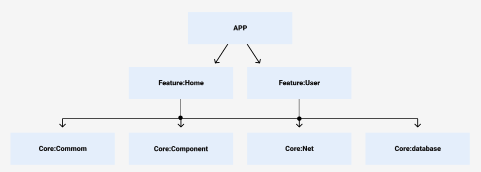

# Projeto Modularizado

Este projeto é uma aplicação Android modularizada, desenvolvida com Jetpack Compose e arquitetura MVVM. O projeto está organizado em vários módulos para facilitar a manutenção, a escalabilidade e o desenvolvimento colaborativo.

## Estrutura do Projeto

### Módulo `app`

- **Descrição**: Este módulo é responsável pela criação da Activity principal e controle de rotas da aplicação.
- **Responsabilidades**:
    - Configuração da Activity principal.
    - Configuração do Jetpack Navigation para navegação entre as telas.

### Módulo `feature:home`

- **Descrição**: Contém a tela responsável por exibir a lista de usuários com funcionalidade de pesquisa.
- **Arquitetura**: MVVM
- **Responsabilidades**:
    - Implementação da UI para listar usuários.
    - Lógica de pesquisa de usuários.

### Módulo `feature:user`

- **Descrição**: Contém a tela responsável por exibir os detalhes e repositórios dos usuários.
- **Arquitetura**: MVVM
- **Responsabilidades**:
    - Implementação da UI para mostrar detalhes do usuário.
    - Exibição de detalhes e repositórios associados ao usuário.

### Módulo `core:common`

- **Descrição**: Mantém código Kotlin comum que pode ser usado por todos os módulos.
- **Responsabilidades**:
    - Definição de utilitários e funções auxiliares reutilizáveis.

### Módulo `core:components`

- **Descrição**: Mantém componentes UI reutilizáveis que podem ser usados em todas as features.
- **Responsabilidades**:
    - Implementação de componentes de UI compartilhados.
    - Criação de estilos e temas reutilizáveis.

### Módulo `core:net`

- **Descrição**: Responsável pela comunicação HTTP e disponibilização de `RemoteDataSource`.
- **Responsabilidades**:
    - Configuração do Retrofit para chamadas de rede.
    - Implementação de fontes de dados remotas.

### Módulo `core:database`

- **Descrição**: Responsável pela comunicação com o banco de dados local e disponibilização de `LocalDataSource`.
- **Responsabilidades**:
    - Configuração do Room para persistência local.
    - Implementação de fontes de dados locais.

## Estrutura do Código das Features (home/user)

A estrutura do código segue o padrão MVVM (Model-View-ViewModel) nas features, promovendo uma separação clara de responsabilidades. 
Esta organizada em duas camadas principais:

### UI Layer

- **Composables**: Responsáveis por desenhar a interface do usuário utilizando o Jetpack Compose.
- **ViewModels**: Controlam o estado da interface do usuário, lidando com interações e fornecendo dados da `Data Layer` para os composables.

### Data Layer

- **Modelos**: Representações de dados que a aplicação manipula.
- **Mappers**: Realizam transformações entre diferentes representações de dados, como a conversão de entidades da rede para entidades de domínio.
- **Repositórios**: Gerenciam a lógica de negócios e o fluxo de dados entre diferentes fontes de dados (remotas e locais), fornecendo dados para as `ViewModels`.

